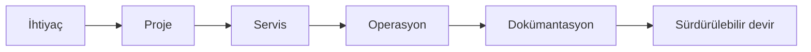

# IEEE İKÇÜ TechOps

**Dijital altyapı · Otomasyon · Teknik operasyonlar**

IEEE İzmir Kâtip Çelebi Üniversitesi Öğrenci Kolu'nun sürdürülebilir teknik altyapısını kuran ve işleten ekip.

---

## TechOps nedir?

TechOps; IEEE İKÇÜ'nün dijital servislerini, entegrasyonlarını ve teknik bilgisini kişilere bağımlı olmadan sürdürülebilir hale getirir. Yeni sistemler geliştirmenin yanında mevcut sistemleri standartlaştırır, belgeler ve sonraki ekibe güvenli şekilde devreder.

## Çalışma alanlarımız

| Alan | Kapsam |
| --- | --- |
| Üyelik sistemleri | Kimlik doğrulama, roller ve üye deneyimi |
| Etkinlik operasyonları | Başvuru, katılımcı, check-in ve sertifika akışları |
| Otomasyon | Tekrarlayan işlerin ve veri aktarımlarının otomasyonu |
| Web servisleri | Web sitesi, yönetim panelleri ve API'ler |
| Teknik altyapı | Hesaplar, erişimler, yedekleme ve servis sürekliliği |
| Teknik hafıza | Mimari kararlar, rehberler, runbook'lar ve devir belgeleri |

## Bu repoda ne var?

Bu depo TechOps'un açık teknik merkezi ve dokümantasyon kaynağıdır. Kişisel veri, parola, erişim anahtarı veya gizli sistem yapılandırması içermez.

- [Projeler](PROJECTS.md): yürütülen ve planlanan çalışmalar
- [Yol haritası](ROADMAP.md): öncelikler ve ilerleme
- [Sistem durumu](STATUS.md): servislerin işletim ve izleme görünümü
- [Dokümantasyon](docs/index.md): teknik el kitabı
- [Yönetişim](GOVERNANCE.md): roller ve karar modeli
- [Katkı rehberi](CONTRIBUTING.md): geliştirme süreci
- [Güvenlik](SECURITY.md): güvenli bildirim kanalı

## Mevcut ekosistem

| Alan | Sistem |
| --- | --- |
| Web | WordPress |
| Kimlik ve üye verisi | Firebase |
| Etkinlik yönetimi | HeptaCert |
| Operasyonel çalışma | Google Workspace |
| Kaynak kodu ve teknik hafıza | GitHub |
| Entegrasyonlar | REST API, webhook ve kontrollü veri aktarımı |

## Katkıda bulun

Bir sorun gördüysen issue açabilir, yeni proje önerebilir veya mevcut bir işi üstlenebilirsin. Başlamadan önce [katkı rehberini](CONTRIBUTING.md) ve [davranış kurallarını](CODE_OF_CONDUCT.md) oku.

> Güvenlik açıklarını herkese açık issue olarak paylaşma; [güvenlik politikasındaki](SECURITY.md) özel bildirim yöntemini kullan.

---

**Sürdürülebilir altyapı. Belgelenmiş süreçler. Devredilebilir sistemler.**

