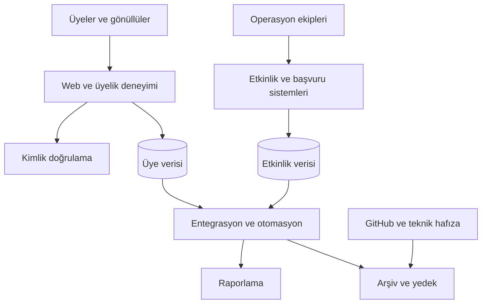

# Mimari Yaklaşım

TechOps tek bir büyük uygulama değildir. Alanında güçlü servisler, açık sahiplik ve kontrollü entegrasyonlarla birlikte çalışır.

## Tasarım ilkeleri

### Modülerlik

Bir servis gerektiğinde diğerlerini yeniden yazmadan değiştirilebilmelidir. Entegrasyon noktaları açıkça belgelenir.

### Tek doğruluk kaynağı

Her ana veri türünün tek bir yetkili kaynağı olur. Geçici CSV ve Sheet kopyaları yeni bir veri tabanına dönüşmez.

### Organizasyon sahipliği

Üretim sistemi, domain, proje ve kurtarma yöntemi tek bir kişinin özel hesabına bağlı olmaz.

### En az ayrıcalık

Kullanıcı ve otomasyonlar yalnızca gerekli yetkiye sahip olur. Yönetici erişimi varsayılan değildir.

### Gözlemlenebilirlik

Kritik işlerde başarı, hata, gecikme ve veri tutarsızlığı tespit edilebilir olmalıdır.

## Yeni servis kontrolü

- [ ] Açık bir sahibi ve yedeği var.
- [ ] Veri sınıfı ve authoritative source belli.
- [ ] Erişim ve secret yönetimi tanımlı.
- [ ] Maliyet ve yenileme tarihi kayıtlı.
- [ ] Yedekleme, kurtarma ve kapatma planı var.
- [ ] Önemli mimari karar ADR olarak kaydedildi.

