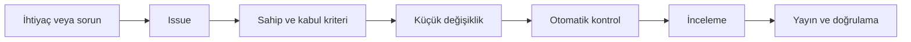

# Başlangıç

TechOps'un amacı yalnızca yazılım geliştirmek değil, IEEE İKÇÜ'nün dijital operasyonlarını güvenli ve devredilebilir hale getirmektir.

## İlk hafta kontrol listesi

- [ ] GitHub hesabında çok faktörlü kimlik doğrulamayı etkinleştir.
- [ ] Yalnızca görevin için gereken organizasyon takımına katıl.
- [ ] [Güvenlik ilkelerini](standards/security.md) oku.
- [ ] [Projeleri](projects.md) ve [yol haritasını](roadmap.md) incele.
- [ ] Küçük bir issue veya belge düzeltmesi seç.
- [ ] Pull request akışını en az bir kez tamamla.
- [ ] Sorumlu olduğun servis için sahibi ve yedeği öğren.

## Günlük çalışma akışı

## Bilgiyi nereye koymalıyım?

| Bilgi | Yer |
| --- | --- |
| İş, hata veya öneri | GitHub Issues |
| Kalıcı teknik karar | ADR |
| Tekrarlanabilir teknik işlem | Runbook veya operasyon rehberi |
| Kaynak kodu | İlgili proje reposu |
| Genel teknik belge | Bu repo |
| Parola ve erişim anahtarı | Onaylı secret store; asla repo değil |
| Üye veya katılımcı verisi | Yetkili üretim sistemi; asla repo değil |

## Yardım isterken

Sorunu, beklenen sonucu, denediklerini ve güvenli hata çıktısını paylaş. Ekran görüntüsünde kişisel veri veya secret bulunmadığından emin ol. Güvenlik şüphesi varsa herkese açık issue yerine [özel bildirim kanalını](https://github.com/ieeetechops/ieeetechops/security/policy) kullan.
