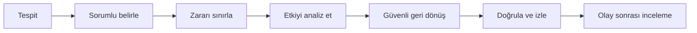

# Olay Yönetimi

Bu rehber servis kesintisi, veri kaybı, yetkisiz erişim veya secret sızıntısı şüphesinde izlenecek genel akışı tanımlar.

## Öncelik seviyeleri

| Seviye | Örnek | İlk hedef |
| --- | --- | --- |
| SEV-1 | Aktif hesap/veri riski veya yaygın kesinti | Derhal sahiplen ve sınırla |
| SEV-2 | Kritik işlev bozuk, geçici çözüm var | Aynı gün içinde müdahale |
| SEV-3 | Sınırlı etki veya bakım ihtiyacı | Planlı düzeltme |

## Müdahale akışı



1. Olay sorumlusunu ve tek bir koordinasyon kanalını belirleyin.
2. Başlangıç zamanı, belirti ve etkilenen servisleri kaydedin.
3. Zararı sınırlandırın: hatalı yayını geri alın, erişimi askıya alın veya secret'ı döndürün.
4. Kanıtları koruyun; logları değiştirmeyin ve kişisel veriyi daha geniş gruba yaymayın.
5. Temel işlevleri ve veri bütünlüğünü doğrulayarak servisi kontrollü açın.
6. Kritik olay sonrası takip işlerini sahip ve son tarihle oluşturun.

## Durum güncellemesi

```text
[SEV-x] Kısa olay adı
Başlangıç / son güncelleme:
Etkilenen servis ve kullanıcılar:
Mevcut etki:
Yapılan işlem:
Sonraki kontrol:
Olay sorumlusu:
```

Olay sonrası inceleme kişileri suçlamak için değil, kontrol ve süreçleri iyileştirmek için yapılır.

