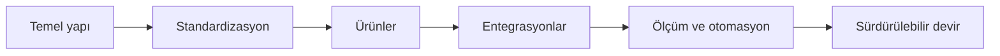

# Yol Haritası

Yol haritasının kaynak dosyası [`ROADMAP.md`](https://github.com/ieeetechops/ieeetechops/blob/main/ROADMAP.md) içinde güncellenir.

## Önceliklendirme

İşler yalnızca ilgi çekici oldukları için değil, aşağıdaki ölçütlerle sıralanır:

- Kullanıcı ve operasyon etkisi
- Güvenlik veya veri riski
- Aciliyet ve bağımlılıklar
- Geliştirme ve sürekli bakım maliyeti
- Ekip kapasitesi ve devredilebilirlik

Güncel görevler [GitHub Issues](https://github.com/ieeetechops/ieeetechops/issues) üzerinden izlenir.

